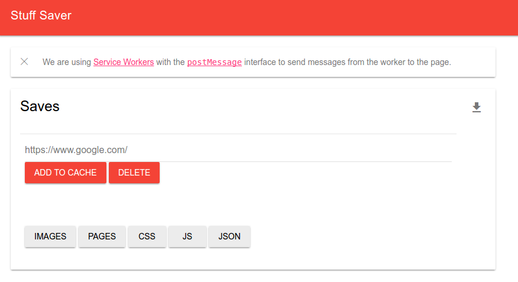

# Service Worker Stuff Saver

[Stuff Saver](https://vsoch.github.io/resource-saver)

This is a static URL that uses a [service worker](https://developer.mozilla.org/en-US/docs/Web/API/Service_Worker_API) with the [postMessage](https://html.spec.whatwg.org/multipage/workers.html#dom-worker-postmessage) interface to send messages back and forth between a service worker and a static website. This means that you can save and retrieve links, images, and script URLS across windows and sessions! This demo is intended for Chrome. To modify, stop, or remove workers, visit [chrome://serviceworker-internals](chrome://serviceworker-internals).

Inspired by the [post-message](https://googlechrome.github.io/samples/service-worker/post-message/index.html) demo.
Learn more about service workers and post-messages at [chrome status](https://www.chromestatus.com/feature/6561526227927040)
